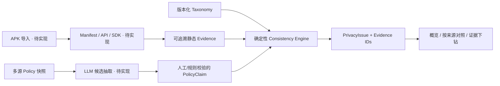

# 架构决策 ADR-001

状态：建仓默认方案；后续变更需记录理由。日期：2026-10-02。

后端使用 Python 3.11+ / FastAPI / Pydantic，便于接入 Python APK 分析生态；前端使用 Vue 3 / TypeScript / Vite。数据库基线为 SQLite，当前只有 schema，待样本主线接入。建仓使用 uv 和 npm 锁定依赖，不引入工作流队列、RAG 或多智能体框架。

当前真实运行路径：合成 JSON → Pydantic 校验 → 规则引擎 → API → 报告页面。它验证类型契约和规则行为，不能证明 APK 分析有效性。

## 数据模型

- `PrivacyBehavior`：静态潜在数据访问或能力，引用 Manifest/API/SDK Evidence。Purpose、Recipient、Transfer、TemporalScope 先保留 UNKNOWN。
- `PolicyClaim`：独立政策源中的声明，引用对应文档的原句，不修改行为事实。
- `ContextualHint`：明确标记的推断值与依据，目前仅预留结构。
- `PolicyDocument`：来源、版本、采集时间、完整性、文本、SHA-256 和完整快照证据；政策不能拼成一个来源。
- `PrivacyIssue`：确定性状态、适用范围、行为、政策文档、Evidence IDs 与模板解释。
- `AnalysisJob`：样本、输入模式、规则版本、状态、时间与错误；当前只提供类型，不提供任务调度。

原简报第 12 页把 DECLARED_PURPOSE 放在“事实”一列，但正文强调事实/声明/推断分开。本仓库把政策声明目的存在 `PolicyClaim.declared_purpose`；代码事实中的 Purpose 保留 UNKNOWN，防止政策自述被当成程序运行事实。

## 初版规则边界

有 API 访问证据才能核验潜在访问；单独权限或 SDK 特征不足。针对每个宿主政策分别判断具体类型、上位类别、模糊候选、缺失候选或证据不足。没有候选时，只有完整快照才能输出未找到声明；此结果依赖已整理 claims 的覆盖度，仍需原文复核。

精确与类别匹配只覆盖数据类型。未来增加目的、接收方、行为、范围的独立具体性维度和版本匹配；当前不把这些字段省略当作已充分声明。跨来源冲突限不同宿主渠道的一方有声明、另一方没有声明；同一渠道的两个版本不会直接触发该规则。SDK 政策不参与宿主补声明或冲突计算，独立 SDK 核验后续实现。

输入校验：唯一 ID、引用存在、来源类型、快照哈希、原句存在、规则版本、数据类型、声明/静态证据边界。输出可沿 Evidence IDs 回到来源位置。当前规则不判断代码可达性、运行时触发、数据流或目的。

## API

| 方法 | 地址 | 当前功能 |
|---|---|---|
| GET | `/api/v1/health` | 健康检查，mode=scaffold |
| GET | `/api/v1/taxonomy` | 版本化分类体系 |
| GET | `/api/v1/demo/report` | 明确标识的合成报告 |
| GET | `/api/v1/demo/evidence/{id}` | 合成证据详情 |
| POST | `/api/v1/consistency/evaluate` | 已结构化证据的纯规则核验 |

POST 不接受 APK，不执行上传代码，也不调用模型。尚无鉴权、限流或部署配置，仅用于本机开发。最大输入列表长度由模型约束。后续公开服务前另设上传、隔离处理、作业状态、资源限制和数据删除流程。

## AI 接入约定

AI 的产品用途在 Policy Parser：切分、结构化、候选解释；规则负责最终状态。后续密钥仅放服务端环境变量，候选必须通过编号、原句、分类与来源校验；抽取失败要有可恢复状态。不得因 APK 或政策中出现指令文本而执行工具动作。
