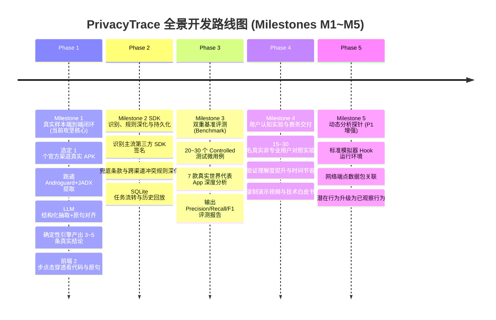

# PrivacyTrace 开发计划与技术路线（团队全景版）

> **文档版本**：v2.1.0（2026-10-03 全景增强版）  
> **制定依据**：《PrivacyTrace · 技术栈与开源复用简报 v0.1》（PRD MVP 简报）、仓库架构决策（ADR-001）、Backlog 与 Milestone 1 真实样本验收规范  
> **核心定位**：成熟开源工具负责“提取底层证据”，PrivacyTrace 负责“统一建模、解释证据、核验声明并面向普通用户呈现”

---

# 📢 【人话简报】写给全体组员的白话速读指南

> **导读**：组里的各位同学，在看后面密密麻麻的技术指标和任务清单前，请花 3 分钟读完这一节。读完你就能彻底明白**我们在做什么、为什么这么做、四大不可触碰的红线、以及你负责哪一块**。

### 1. 咱们这个项目到底是干啥的？（项目初衷与现实痛点）

一句话：**做一款面向普通手机用户的“App 隐私体检仪与测谎仪”。**

- **现实痛点**：
  1. **用户看不见**：普通用户在手机上安装使用 App，根本不知道它在后台悄悄申请了什么权限、偷偷调用了哪些敏感接口（比如读取剪贴板、获取精准 GPS、扫描设备标识符）。
  2. **政策读不懂**：各大 App 动辄几十页、上万字晦涩冗长的《隐私政策》，充斥着法务公文辞令（“我们可能会在合理必要范围内为了优化服务而收集您的相关信息”），99.9% 的普通用户直接闭眼点“同意”，根本没时间也没专业能力去逐字推敲。
  3. **说了算不算数没人核验**：App 到底有没有做到“言行一致”？市面上现有的逆向分析工具（如 MobSF）是给专业安全工程师看 CVE 漏洞或 CVSS 风险分的，满屏全是十六进制内存地址和混淆包名，普通人完全看不懂。
- **我们的解法与核心表达**：
  - **01 Android 权限告诉用户**：App 被系统允许做什么（系统授权层）；
  - **02 隐私政策 / 商店声明告诉用户**：App 声称自己做什么（合规自述层）；
  - **03 PrivacyTrace 尝试告诉用户**：程序中实际存在什么隐私行为证据，以及这些行为到底有没有向用户清楚声明（一致性核验与透明解释层）。
- **原创贡献官方口径（答辩统一口径）**：
  > **“PrivacyTrace 不主张首次提出‘代码行为与隐私政策一致性分析’。我们的第一原创贡献应表述为：把专业级、多源、可追溯的隐私证据，转化为普通用户能理解、能复核的 App 隐私体检。”**

---

### 2. 我们千万不能犯的四大高压红线

在项目推进与对外展示过程中，全体组员必须时刻牢记以下四大高压红线，任何违背均可能导致技术答辩失分或引发法律伦理风险：

#### 🔴 红线一：别自己造轮子（防累死）
- 解析 APK 的 ZIP 结构、从二进制 AXML 提取 `AndroidManifest.xml` 权限、把 DEX 字节码反编译成 Java 源码……这些底层“脏活累活”开源界早就有了工业级解决方案（如 **Androguard**、**JADX**）。
- 我们直接复用成熟工具的 Python 库或 CLI 工具提取基础事实。**严禁从零写反编译器，不要把时间浪费在成熟开源工具已经完美解决的问题上！**

#### 🔴 红线二：坚决杜绝简单套壳（防被评委判零分）
- 如果我们只是把 APK 丢给 MobSF 扫描，直接拿它的扫描 JSON 套个好看的 Vue 界面，评委和审阅老师一眼就能看穿，直接判定为“伪原创套皮”。
- **开源工具只负责提取冰冷的客观证据，PrivacyTrace 的自研护城河在于：**
  1. **统一概念字典 (Privacy Taxonomy)**：建立代码 API、系统权限与自然语言政策之间的层级映射桥梁；
  2. **标准证据模型 (Evidence Model)**：严格绑定物理证据（行号、原句、SHA-256）；
  3. **确定性核验法官 (Consistency Engine)**：纯规则 6 大状态机，拒绝大模型随机构造；
  4. **通俗易懂三层体检报告**：普通人看懂人话，评委 2 步点击穿透看代码和原句。

#### 🔴 红线三：严谨措辞绝不越界（防法律伦理与被抓把柄）
以下高危表述**绝对禁止**出现在任何产品界面、报告文案、评测结论和答辩 PPT 中：
- ❌ **严禁**把“存在权限 / 静态检测到敏感 API”直接说成“App 正在实际收集/窃取用户数据”；
- ❌ **严禁**输出“违法 / 合法”总裁决（合规裁决属于司法监管部门，工具只陈述一致性事实）；
- ❌ **严禁**输出“安全 / 不安全”总裁决；
- ❌ **严禁**输出“建议卸载”等激进用户行动建议；
- ❌ **严禁**把模型推断出的 Purpose 当作已确认的事实陈述。
- ✅ **正确规范表达**：
  - 静态结果统一称为：“检测到代码中存在……的**能力 / 静态潜在行为证据**”；
  - 政策问题统一称为：“这份政策只说明了……，**未明确说明……**”；
  - 动态结果（P1）才可称为：“运行时已观察行为”。

#### 🔴 红线四：事实 / 声明 / 推断必须分开存（防逻辑混淆与自欺欺人）
全项目最核心的数据架构铁律：
- **代码事实 (Behavior)**：代码里调了获取位置 API，这就是物理事实。但在代码里，`purpose`（目的）、`recipient`（接收方）严格存为 `"UNKNOWN"`！绝不能因为方法名叫 `uploadLoc()` 就自作聪明把目的填成“导航”；
- **政策声明 (Claim)**：隐私政策声称“为了导航收集精确位置”，这是开发者的自述声明，存入 `PolicyClaim.declared_purpose`；
- **模型推断 (Hint)**：大模型分析上下文猜测的目的，必须存入 `ContextualHint`，标记 `basis = "CONTEXTUAL_PURPOSE_HINT"`，永远不能混充事实！

---

### 3. 一图看懂系统怎么跑起来的（端到端数据流架构）

```text
       【输入 1】真实 APK 安装包                       【输入 2】多源隐私政策文本
                   │                                             │
                   ▼                                             ▼
        ┌─────────────────────┐                       ┌─────────────────────┐
        │  Androguard / JADX  │                       │   快照哈希与 LLM 抽取  │
        │ (底层 AXML/DEX 提取) │                       │ (结构化声明与原句截取) │
        └──────────┬──────────┘                       └──────────┬──────────┘
                   │ 原始权限 / API 签名                         │ 政策原句 / 声明条目
                   ▼                                             ▼
        ┌───────────────────────────────────────────────────────────────────┐
        │               PrivacyTrace 统一隐私分类字典 (Taxonomy)             │
        │            (把“Android 代码接口”与“政策中文汉字”映射为同一概念)       │
        └──────────────────────────────────┬────────────────────────────────┘
                                           │
                                           ▼
        ┌───────────────────────────────────────────────────────────────────┐
        │                 标准可追溯证据模型 (Evidence Model)                │
        │    严格区分：代码行为事实 (UNKNOWN)  vs  政策文本声明 (DECLARED)      │
        │             所有实体强制校验 SHA-256、外键引用与原句子串包含           │
        └──────────────────────────────────┬────────────────────────────────┘
                                           │
                                           ▼
        ┌───────────────────────────────────────────────────────────────────┐
        │                确定性一致性核验引擎 (Consistency Engine)            │
        │       100% 规则驱动状态机 ── 严密对质产生 6 大确定性核验状态:         │
        │   EXACT_MATCH / CATEGORY_MATCH / NOT_DECLARED / AMBIGUOUS ...     │
        └──────────────────────────────────┬────────────────────────────────┘
                                           │
                                           ▼
        ┌───────────────────────────────────────────────────────────────────┐
        │                  面向普通用户的交互式体检报告 (Web UI)              │
        │   顶层：通俗风险体检概览  ──  中层：一致性核验矩阵  ──  底层：双向证据穿透 │
        │              (支持 2 步点击直接穿透到 JADX 代码行与政策原句)          │
        └───────────────────────────────────────────────────────────────────┘
```

---

### 4. 组员分工定位（对号入座）

全体组员请根据自身技能特长对号入座，紧扣各自责任田：

- 💻 **逆向 / 后端开发**：
  - 负责熟练运用 `Androguard` 解析 APK Manifest 权限与 DEX 字节码，用 `JADX` 提取敏感 API 调用点上下文源码片段与行号；
  - 组装标准的 `Evidence(kind="MANIFEST"/"API", status="STATIC_POTENTIAL")` 并对接后端 FastAPI。
- 🤖 **NLP / 大模型工程**：
  - 负责设计隐私政策文本的无损句子切分器（Chunker），编写高质量抽取 Prompt；
  - 调用 LLM 提取数据项、行为与目的声明，实现**抗幻觉校验器**（确保抽取的政策原句 100% 为文档全文子串，拒绝模型凭空瞎编）。
- ⚖️ **规则引擎 / 核心算法**：
  - 维护和扩充 `Privacy Taxonomy`（完善权限、API 和政策短语的 DAG 层级映射）；
  - 维护 `consistency.py` 确定性规则比对逻辑，确保 6 种状态机判定逻辑严密、零随机性、用例 100% 通过。
- 🎨 **前端 / 交互设计**：
  - 负责 Vue 3 + TypeScript 界面打磨，实现三层递进体验（小白通俗卡片、专业一致性矩阵表格、双向证据下钻抽屉）；
  - 确保用户 2~3 次点击内直达底层 JADX 代码行与政策原句。
- 🧪 **测试 / 评测实验**：
  - 推进 Milestone 1 真实样本全流程验收（M1~M7 闭环）；
  - 负责收集真实 APK 与政策快照，人工复核并编写 `evidence/review.<sample_id>.md`；
  - 推进后续 20~30 个 Controlled Benchmark 用例与普通用户认知对照实验。

---

# 🛠️ 总体技术栈与开源复用边界

### 1. 技术栈全景与分层矩阵表

| 系统层次 | 推荐选型 | 定位与分工 | 开源复用 vs 自研边界 |
|---|---|---|---|
| **Web 前端** | Vue 3 + Vite + TypeScript (Pinia) | 用户隐私体检报告展示、证据双向穿透交互 | **100% 自研** 页面结构、下钻抽屉与三层交互逻辑 |
| **后端 API** | FastAPI + Python 3.11+ | 业务流程调度、规则计算与标准 JSON 契约输出 | **100% 自研** 调度架构，Pydantic v2 强类型契约严格约束 |
| **APK 静态解析** | **Androguard** (Python 库) | 读取 APK 结构、提取 Manifest 权限、检索 DEX 字节码 | **成熟开源复用**：仅作为无状态的底层二进制事实提取器 |
| **源码反编译** | **JADX** (CLI / 后台子进程) | 将 DEX 字节码转为 Java 源码，提供上下文行号与代码切片 | **成熟开源复用**：仅作为受控的代码切片提供器，支撑用户下钻 |
| **数据流增强** | **FlowDroid** | Source → Sink 跨过程污点分析 | **P1 增强能力（MVP 冻结）**：不作为阻断主链路的依赖 |
| **规则与竞品参考** | **MobSF / VioDroid-Finder** | 参考 SDK 签名规则与行业评测对比基线 | **参考对照**：吸收其公开 SDK 签名包名，**严禁直接套壳包装** |
| **政策解析与 NLP** | LLM API (Gemini/OpenAI) + 规则校验 | 政策文本切分、条款实体识别、抗幻觉原句对齐 | **自研 Prompt 与后验规则**：LLM 仅出候选，规则锁死原句 |
| **数据存储** | **SQLite** (轻量文件库) | 样本元数据、任务流转状态、证据包持久化 | **轻量内置**：无须配置重型数据库中间件 |
| **评测与质保** | **pytest + ruff + 真实基准** | 单元测试、契约强校验、静态代码扫描、真实复核 | **100% 自研** 自动化回归测试套件与人工复核流 |

---

### 2. 核心开源工具深度边界剖析（防套壳论证）

为向竞赛评审专家、导师及全组同学充分证明本项目的技术自研性与创新价值，下表对四大相关开源工具进行深度边界剖析：

#### 🔍 1. Androguard
- **定位**：APK 底层静态事实提取器（二进制与 DEX 结构解析底座）。
- **技术边界**：负责从 APK 的 ZIP 容器中解压提取 `AndroidManifest.xml`，解析 AXML 获取声明权限、四大组件；扫描 `classes.dex` 字节码中的 Dalvik 指令，定位调用敏感 API 的类名与方法名。
- **为何受控 / 局限性**：
  - Androguard 纯粹是一个逆向解析工具，**完全不理解任何隐私法律与合规语义**。它不知道 `getLastKnownLocation` 在中国《个人信息保护法》或隐私政策中对应“精细地理位置”，更不具备理解自然语言隐私政策的能力；
  - 纯 Python 实现，无 JVM 启动开销，非常适合作为后端微服务的底层数据源。
- **与 PrivacyTrace 的互补协同**：
  - Androguard 充当“事实采集探针”，将其发现的底层特征包装为 PrivacyTrace 的标准 `Evidence(kind="MANIFEST"/"API", status="STATIC_POTENTIAL")`。Androguard 绝不触碰上层逻辑。

#### 🔍 2. JADX
- **定位**：代码证据可视化与定位器（DEX 到 Java 伪代码反编译引擎）。
- **技术边界**：将 DEX 字节码反编译为人类可读的 Java 源代码，为调用点提供精准的文件名、类名、方法名以及行号（如 `LocationHelper.java:42`）。
- **为何受控 / 局限性**：
  - JADX 是通用的反编译软件，不包含任何隐私合规核验算法；
  - 全量反编译大型工业级 App 耗时极长（数分钟到数十分钟）且极易发生内存溢出（OOM）。
  - **受控调用原则**：PrivacyTrace 仅在需要提取特定敏感 API 证据时，以受控方式调用 JADX CLI 提取目标类/方法的局部上下文代码（前后 3~5 行），坚决不在扫描主链路中做无节制的全量反编译。
- **与 PrivacyTrace 的互补协同**：
  - 为前端第三层下钻提供高精度的 `locator` 与 `excerpt` 代码段，让普通用户和评委可以亲眼看到代码原貌，实现“结论可穿透复核”。

#### 🔍 3. FlowDroid
- **定位**：P1 阶段数据流与污点分析增强器（Source → Sink 跨过程分析）。
- **技术边界**：学术界经典的静态污点分析工具，用于精确追踪敏感数据（Source，如 GPS）是否真正流入网络发送接口（Sink，如 `HttpURLConnection`）。
- **为何受控（局限性与严格后置理由）**：
  - **重型且脆弱**：FlowDroid 高度依赖完整精确的 Call Graph 与 Android 生命周期建模。现代商业 App 普遍存在代码加固、混淆（ProGuard/R8）、反射调用、动态类加载、跨进程 IPC 及复杂异步框架（RxJava/Coroutines），在真实大应用上 FlowDroid 极易发生路径爆炸、内存溢出或调用图断裂而直接报错崩溃；
  - 《PRD MVP 简报》第 6 节明确规定：“**明确禁止：静态主链路未打通，却先投入大量时间折腾 Frida、污点分析、反调试。工期不足时动态分析与 FlowDroid 可整体冻结。**”
- **与 PrivacyTrace 的互补协同**：
  - FlowDroid 定位为可选的可插拔插件，仅在小型受控 Benchmark 中对典型行为做深度数据流验证，绝不成为阻断系统运行的前置强依赖。

#### 🔍 4. MobSF
- **定位**：行业移动安全扫描框架与公开特征参考标杆。
- **技术边界**：成熟的一体化移动安全自动化扫描平台，覆盖 Android/iOS 静态漏洞与动态安全测试。
- **坚决防简单套壳论证**：
  - MobSF 侧重于通用安全漏洞、代码硬编码密钥、弱加密算法及 CVSS 风险评分；它**完全不具备针对 App 隐私政策自然语言的多源双向语义核验能力**；
  - 若直接调用 MobSF 扫描接口并换个前端，属于严重违规的“伪原创简单套壳”，没有任何学术与研发价值；
  - **严禁直接引入 MobSF 引擎作为核心依赖**。
- **与 PrivacyTrace 的互补协同**：
  - 仅吸收借鉴 MobSF 公开的 SDK 签名规则（如识别各主流第三方 SDK 的包名前缀与特征类），沉淀为 PrivacyTrace 独立的 `rules/sdk-signatures.v0.1.json`。核心证据模型与规则比对 100% 独立自研。

---

### 3. 核心论点总结

> **成熟开源工具负责提取冰冷、客观、底层的物理证据；  
> PrivacyTrace 负责统一建模、解释证据、核验声明，并面向普通用户进行直观呈现。**

---

# 🧱 PrivacyTrace 自研四大核心资产（护城河）

以下四个核心资产是本项目的核心研发成果与创新护城河，任何第三方工具均不可替代：

### 1. Privacy Taxonomy（统一隐私概念字典与层级映射）
- **核心定位**：解决“代码接口与隐私政策汉字互不相通”的语义鸿沟。
- **结构规范**：
  - 包含 14 个具备 DAG/Tree 树状继承关系的数据类型（涵盖 `LOCATION` 派生出的 `PRECISE_LOCATION` / `COARSE_LOCATION`；`DEVICE_IDENTIFIER` 派生出的 `ANDROID_ID` / `OAID` / `IMEI`；`CONTACTS`；`CAMERA`；`MICROPHONE` 等）；
  - 提供系统权限三向映射：`permission_mappings`（5 条核心权限，严格标记 `CAPABILITY_ONLY`）；
  - 提供系统 API 签名映射：`api_mappings`（如 `LocationManager.getLastKnownLocation` → `PRECISE_LOCATION`）；
  - 提供自然语言政策短语映射：`policy_phrase_mappings`（12 条高频政策中文短语映射）。
- **上下位继承算法**：内置 `ancestors(data_type)` 递归算法，支持上位宽泛声明判定（如代码调了 `OAID`，政策只写了 `DEVICE_INFORMATION`，算法判定为上位泛化声明）。

### 2. Evidence Model（标准化可追溯证据模型与三分法）
- **核心定位**：将所有分析结论牢牢锚定在不可篡改的底层物理证据链条上。
- **事实 / 声明 / 推断三分法机制**：
  1. **代码行为事实 (`PrivacyBehavior`)**：
     - `action` 标记为 `ACCESS`（调用 API）或 `CAPABILITY`（权限能力）；
     - `purpose`、`recipient`、`transfer`、`temporal_scope` **严格固定为 `"UNKNOWN"`**，绝对不把推测作为既成事实。
  2. **政策声明事实 (`PolicyClaim`)**：
     - 来源标记为 `basis = "POLICY_DECLARATION"`；
     - 记录开发者声称的 `declared_purpose` 与 `declared_recipient`；
     - 必须强绑定对应的政策快照文档 ID 及具体的句子证据 ID。
  3. **上下文推断线索 (`ContextualHint`)**：
     - 大模型或启发式规则推断的目的仅作为线索，标记为 `basis = "CONTEXTUAL_PURPOSE_HINT"`，并说明推断理由。
- **数据强校验机制**：
  - Pydantic 模型内置校验：静态证据必须为 `STATIC_POTENTIAL` 且禁止 `document_id`；政策证据必须为 `DECLARED` 且必须有 `document_id`；
  - 政策快照文本必须通过 SHA-256 64 位十六进制哈希校验；引用的政策原句必须 100% 为快照文本的精确子串。

### 3. Consistency Engine（6 大确定性状态机与确定性规则）
- **核心定位**：纯规则驱动的裁决算法，杜绝大模型“随机发挥”与“幻觉判定”。
- **输入与输出**：`evaluate(bundle: EvaluationInput) -> EvaluationResult`，输入规范数据包，输出包含确定性状态的问题列表。
- **6 大状态机流转准则**：
  1. `EXACT_MATCH`（精确匹配）：代码存在敏感 API 调用，宿主政策明确声明了该精细数据类型；
  2. `CATEGORY_MATCH`（上位匹配 / 粒度不足）：代码调用了精细数据项（如 OAID），政策全文仅声明了上位大类（如设备信息）；
  3. `AMBIGUOUS_DISCLOSURE`（模糊披露）：政策存在相关表述，但包含“包括但不限于”、“可能收集法律允许的一切信息”等无限兜底条款（`CATCH_ALL`），或行为表述极度含糊；
  4. `NOT_DECLARED`（未声明）：代码明确存在敏感 API 调用，但在完整快照政策中找不到任何相关说明；
  5. `POLICY_SOURCE_CONFLICT`（多源冲突）：同一 App 在不同宿主渠道（如 App 内隐私政策 vs 应用商店公开政策）给出了互斥或一有一无的不一致声明；
  6. `INSUFFICIENT_EVIDENCE`（证据不足）：代码仅声明了 Manifest 权限但未扫描到 API 调用、或仅有 SDK 特征、或政策快照不完整（`PARTIAL`），系统如实告知用户，绝不脑补结论。
- **不可动摇的核心原则**：**第三方 SDK 政策绝对不能代替宿主 App 补充声明！**

### 4. User-friendly Explanation & Evidence Drill-down（三层递进呈现与穿透复核）
- **核心定位**：解决“普通用户看不懂技术术语”与“专业评审需要验证真实性”的双重诉求。
- **三层递进交互结构**：
  - **第一层 · 通俗隐私体检概览（面向普通小白）**：
    - 大白话卡片展示：“检测到代码中存在读取精确位置的能力”、“这份政策只说明了位置信息，没有具体说明精确还是粗略位置”；
    - 绝不使用“严重违法”、“正在偷窃”等攻击性或未证实词汇。
  - **第二层 · Privacy Consistency Matrix 一致性矩阵（面向专业用户）**：
    - 表格列出：隐私数据类型、代码行为（API/权限）、第三方 SDK、应用内政策、商店政策、最终核验结论。
  - **第三层 · Evidence Drill-down 证据下钻抽屉（面向极客与评委）**：
    - 点击表格任一结论，2 步之内滑出证据抽屉：
      - **代码证据**：显示类名、方法名、行号与高亮反编译代码切片（JADX）；
      - **政策证据**：显示官方隐私政策快照原句与章节定位；
      - **未声明情况**：提供一键检索并查看完整政策快照全文入口。

---

# 🎯 分阶段里程碑开发路线（Milestones M1~M5）



### Phase 1 (Milestone 1)：首个真实样本端到端闭环【当前攻坚核心】
- **核心目标**：绝不铺大摊子，用最快速度跑通 **“1 个真实 APK + 1 份真实政策 → 3–5 条真实判定结论 → 页面点击穿透到代码行与原句”**。
- **真实样本验收指标**：严格对齐 `docs/milestone-1.md` 中的 M1~M7 真实样本验收标准。

### Phase 2 (Milestone 2)：SDK 识别、规则深化与持久化
- **核心目标**：
  1. 建立第三方 SDK 识别特征库（`rules/sdk-signatures.v0.1.json`），精准分离主包宿主代码与第三方 SDK 代码；
  2. 实现无限兜底条款（`CATCH_ALL`）与多源政策渠道冲突（`POLICY_SOURCE_CONFLICT`）判定；
  3. 引入 SQLite 本地持久化，支持 AnalysisJob 任务异步流转与报告离线加载。

### Phase 3 (Milestone 3)：双重基准评测（Controlled + Real-world Benchmark）
- **核心目标**：
  1. **Controlled Benchmark**：编写 20–30 个定制化 Android 微应用测试用例，覆盖 6 大状态和各类边界条件，建立标准 Ground Truth 真实标签库，自动化统计准确率、召回率与 F1 分数；
  2. **Real-world Benchmark**：选取 7 款代表性真实 App（5 款主流 App + 2 款挑战性 App），沉淀人工复核记录（`evidence/review.<sample_id>.md`），形成高水平案例分析。

### Phase 4 (Milestone 4)：普通用户认知实验与赛务交付
- **核心目标**：
  1. 招募 15–30 名非计算机专业背景普通手机用户进行认知对照实验（对照组看原生系统权限弹窗与政策原文，实验组看 PrivacyTrace 报告），量化证明理解正确率显著提升、任务完成时间大幅缩短；
  2. 按照 `docs/competition-checklist.md` 核验开源合规性、原创声明与答辩演示材料封装。

### Phase 5 (Milestone 5)：动态分析探针（P1 增强评估）
- **核心目标**：在标准模拟器中借助 Hook 技术监控敏感 API 运行时触发，抓取网络传输端点数据包，将“静态潜在行为”升级为“运行时已观察行为”。在 MVP 阶段严格后置，不阻断主线推进。

---

# 📋 Milestone 1 核心十项 GitHub Issue 规范化拆解

本章节为 Milestone 1（首个真实样本端到端闭环）的核心攻坚工单清单。所有工单严格对齐 `.github/ISSUE_TEMPLATE/task.yml` 模板规范（包含 `pt-id`, `scope`, `acceptance`, `validation` 四大必填字段），并严格对齐 `docs/milestone-1.md` M1~M7 真实样本验收指标：

### 1. 核心十项工单汇总清单

| 序号 | 工单 ID | 建议 Issue 标题 | 所属模块 | 对齐里程碑 | 责任角色 | 核心交付物 |
|:---:|---|---|---|:---:|---|---|
| **1** | **PT-101** | [PT-101] 真实 APK 元数据解析与 SHA-256 二进制固化 | APK Intake | **M1** | 逆向/后端 | `manifest.csv` 样本登记与二进制哈希锁定 |
| **2** | **PT-104** | [PT-104] AndroidManifest 权限与组件提取及证据生成 | Manifest Parser | **M2** | 逆向/后端 | 权限与组件 `MANIFEST` 静态能力证据 |
| **3** | **PT-301** | [PT-301] DEX 敏感 API 扫描与 JADX 调用位置提取 | Sensitive API Scanner | **M2** | 逆向/后端 | 敏感 API 代码行 `CODE_API` 证据与上下文切片 |
| **4** | **PT-503** | [PT-503] 真实隐私政策快照存储、哈希校验与文本切分 | Policy Pipeline | **M3, M4** | NLP/大模型 | 政策全文快照、SHA-256 校验与无损分句库 |
| **5** | **PT-506** | [PT-506] 隐私政策结构化 LLM 提取与无幻觉原句对齐 | Policy Pipeline (LLM) | **M4** | NLP/大模型 | 结构化候选声明与 100% 包含的原句证据 |
| **6** | **PT-203** | [PT-203] Privacy Taxonomy 双向语义映射与层级对齐 | Privacy Taxonomy | **M2, M4, M5** | 规则/算法 | 权限/API/政策短语统一多层级映射字典 |
| **7** | **PT-306** | [PT-306] Evidence Model 标准化装配与双向引用溯源 | Evidence Model | **M2, M3, M4** | 核心自研模型 | 聚合 `EvaluationInput`，三分法隔离与外键自洽 |
| **8** | **PT-701** | [PT-701] 确定性 Consistency Engine 6 大状态规则核验 | Consistency Engine | **M5** | 规则/算法 | 规则状态机执行输出 3~5 条真实 Issue 结果 |
| **9** | **PT-708** | [PT-708] 用户友好型可解释文案生成与人工复核核验 | Explanation Generator | **M6** | 测试/算法 | 通俗中文文案与 `evidence/review.<id>.md` 记录 |
| **10** | **PT-807** | [PT-807] 前端真实体检报告呈现与双向证据穿透复核 | Web Report | **M7** | 前端/交互 | 交互式 Web 报告，2 步穿透查看代码与政策 |

---

### 2. 核心十项详细工单卡片（规范化定义）

```yaml
# ==============================================================================
# Issue 1: [PT-101]
# ==============================================================================
```
#### 📋 [PT-101] 真实 APK 元数据解析与 SHA-256 二进制固化
- **pt-id**: `PT-101`
- **关联里程碑**: `M1`
- **所属模块**: `APK Intake (EPIC 1)`
- **scope**:
  - **输入**:
    - 本地官方渠道真实 APK 文件（存放在受 `.gitignore` 保护的 `samples/private/<app_name>.apk`）；
    - 采集渠道来源元数据（官方应用商店下载 URL、采集时间 `acquired_at`、渠道名称）。
  - **输出**:
    - `samples/real-world/manifest.csv` 中登记首个真实样本记录；
    - 结构化 APK 基础元数据（`package_name`, `version_name`, `version_code`, `min_sdk_version`, `target_sdk_version`, `sha256`, `file_size_bytes`）。
  - **工作范围**:
    - 调用 Androguard `APK` 解析器读取 ZIP 头部与基础包信息；
    - 计算 APK 完整二进制 SHA-256（严格 64 位小写十六进制字符串）；
    - 登记样本元数据至清单文件，锁定版本基线；
    - 异常处理：对加固包或损坏 APK 提供明确的报错与降级提示。
- **acceptance**:
  - 成功在 `samples/real-world/manifest.csv` 中登记首个真实样本（如 `sample_id = "real-sample-001"`）；
  - 本地计算的 `sha256` 与登记表一致，支持独立复核；
  - APK 文件完全隔离在本地机器，严禁提交至 Git 仓库。
- **validation**:
  - 自动化脚本：`uv run --project apps/api python scripts/verify_sample_manifest.py`；
  - 命令行哈希核验：PowerShell `Get-FileHash samples/private/<sample>.apk -Algorithm SHA256`；
  - Git 仓库防泄漏核查：`git status --ignored` 确认 APK 被正确忽略。

```yaml
# ==============================================================================
# Issue 2: [PT-104]
# ==============================================================================
```
#### 📋 [PT-104] AndroidManifest 权限与组件提取及证据生成
- **pt-id**: `PT-104`
- **关联里程碑**: `M2`
- **所属模块**: `Manifest Parser (EPIC 1)`
- **scope**:
  - **输入**:
    - 真实 APK 内的 `AndroidManifest.xml` 二进制 AXML 数据；
    - `Taxonomy` 中的 `permission_mappings` 规则集。
  - **输出**:
    - 声明的权限列表 (`uses-permission`) 与核心四大组件列表；
    - 标准 `Evidence(kind="MANIFEST", status="STATIC_POTENTIAL", locator="uses-permission[n]", excerpt=...)`；
    - 对应的静态行为对象 `PrivacyBehavior(action="CAPABILITY", purpose="UNKNOWN", recipient="UNKNOWN")`。
  - **工作范围**:
    - 使用 Androguard AXML 解析模块读取清单文件；
    - 提取系统敏感危险权限与自定义权限；
    - 严格遵循红线四：权限仅作为能力型事实标记为 `CAPABILITY`，目的强制填为 `UNKNOWN`。
- **acceptance**:
  - 提取的权限与官方 `aapt2 dump badging <sample.apk>` 结果 100% 一致无遗漏；
  - 生成的证据对象通过 Pydantic `Evidence` 校验（`status="STATIC_POTENTIAL"`，`document_id=None`）；
  - 行为对象 `action` 严格为 `"CAPABILITY"`，严禁混淆为已发生访问 `"ACCESS"`。
- **validation**:
  - 单元测试：`uv run --project apps/api pytest tests/test_manifest_parser.py`；
  - 契约回归：`uv run --project apps/api --locked pytest`；
  - 对比校验：与 aapt/androguard CLI 导出比对 0 遗漏。

```yaml
# ==============================================================================
# Issue 3: [PT-301]
# ==============================================================================
```
#### 📋 [PT-301] DEX 敏感 API 扫描与 JADX 调用位置提取
- **pt-id**: `PT-301`
- **关联里程碑**: `M2`
- **所属模块**: `Sensitive API Scanner (EPIC 3)`
- **scope**:
  - **输入**:
    - 真实 APK 解包的 `classes*.dex` 文件；
    - 敏感 API 规则特征集（包含 `LocationManager.getLastKnownLocation`、`Settings.Secure.getString` 等高频 API 签名）。
  - **输出**:
    - 敏感 API 调用点列表：调用类全称 (`class_name`)、方法名 (`method_name`)、Java 源码文件路径及行号 (`line_number`)、调用代码上下文片段 (`excerpt`)；
    - 标准代码证据 `Evidence(kind="API", status="STATIC_POTENTIAL", locator="Class#method:line", excerpt=...)`；
    - 标准行为事实 `PrivacyBehavior(action="ACCESS", purpose="UNKNOWN", ...)`。
  - **工作范围**:
    - 复用 Androguard 字节码指令检索定位调用指令；
    - 受控调用 JADX 反编译对应类，提取前后 3~5 行的源码上下文与精确行号；
    - 过滤系统标准库和通用无害调用，聚焦隐私数据访问接口。
- **acceptance**:
  - 命中首个真实样本中涉及的核心敏感 API（如地理位置、设备标识等至少 2 项）；
  - 每条代码证据必须具备具体类名、方法名和 JADX 行号（例如 `com.example.LocationHelper#getLastLocation:42`）；
  - 提取代码片段前后 3 行真实可读；
  - 正确处理混淆代码（ProGuard/R8），不发生解析卡死或 OOM。
- **validation**:
  - 单元测试：`uv run --project apps/api pytest tests/test_dex_scanner.py`；
  - 人工抽检：在 JADX GUI 中打开该 APK，按提取的类名与行号核对源码一致性；
  - 模型验证：输出数据通过 Pydantic `Evidence` 校验。

```yaml
# ==============================================================================
# Issue 4: [PT-503]
# ==============================================================================
```
#### 📋 [PT-503] 真实隐私政策快照存储、哈希校验与文本切分
- **pt-id**: `PT-503`
- **关联里程碑**: `M3, M4`
- **所属模块**: `Policy Pipeline (EPIC 5)`
- **scope**:
  - **输入**:
    - 真实样本的官方隐私政策全文文本（来自 App 内或官方应用商店页面）；
    - 政策元数据（`source_type`, `version`, `captured_at`, `title`）。
  - **输出**:
    - 归档的政策快照文本及固化的 SHA-256 哈希值；
    - 标准 `PolicyDocument` 实体及 `Evidence(kind="POLICY_DOCUMENT", ...)`；
    - 结构化切分后的句子与段落列表（保留章节层级、段落号与字符偏移量）。
  - **工作范围**:
    - 政策文本格式归一化与清洗（统一换行符、去除非法控制符）；
    - 计算并校验快照文本的 SHA-256（严格正则匹配 `^[a-f0-9]{64}$`）；
    - 实现无损句子切分算法（中文句号、分号、问号、换行符切分），确保切出的每一个句子都是全文的精确子串。
- **acceptance**:
  - 政策快照 SHA-256 哈希校验 100% 匹配（`sha256(text.encode("utf-8")).hexdigest() == doc.sha256`）；
  - 切分后的句子满足：所有切分句子的 `excerpt` 必须在快照全文中原样检索到（`assert sentence.excerpt in doc.text`）；
  - 生成的 `PolicyDocument` 满足 Pydantic 校验标准（文本长度、完整性标识）。
- **validation**:
  - 单元测试：`uv run --project apps/api pytest tests/test_policy_chunker.py`；
  - 遍历断言：脚本遍历所有句子，断言 `assert s in full_text`；
  - 幂等性测试：多次切分输出哈希完全恒等。

```yaml
# ==============================================================================
# Issue 5: [PT-506]
# ==============================================================================
```
#### 📋 [PT-506] 隐私政策结构化 LLM 提取与无幻觉原句对齐
- **pt-id**: `PT-506`
- **关联里程碑**: `M4`
- **所属模块**: `Policy Pipeline (EPIC 5)`
- **scope**:
  - **输入**:
    - PT-503 切分后的政策句子列表；
    - `Taxonomy` 数据类型定义字典；
    - 结构化提取 Prompt 模板。
  - **输出**:
    - 结构化候选声明列表：数据类型 (`data_type`)、行为 (`action="ACCESS"`)、声明用途 (`declared_purpose`)、声明接收方 (`declared_recipient`)、模糊标记 (`ambiguity_flags`)；
    - 严格绑定的政策原句证据 `Evidence(kind="POLICY_SENTENCE", status="DECLARED", document_id=...)`。
  - **工作范围**:
    - 编写严格约束输出 JSON Schema 的抽取 Prompt，调用 LLM 提取条款实体与意图；
    - 构建**抗幻觉校验后处理器**：核对 LLM 提取的句子是否在分句库中精确存在，坚决剔除任何模型篡改文字或臆造句子；
    - 识别兜底模糊条款（如“包括但不限于”、“可能收集法律允许的一切信息”，标记为 `CATCH_ALL`）。
- **acceptance**:
  - 抽取输出严格符合 JSON Schema 契约；
  - **抗幻觉硬性指标**：所有抽取的原句引用必须 100% 存在于 `PolicyDocument` 快照中，若原句不存在则直接拦截报错；
  - 针对真实样本政策成功抽取 5~15 条有效声明，覆盖位置、设备信息等核心类别；
  - 模糊条款正确打上 `CATCH_ALL` 标签。
- **validation**:
  - 单元与 Mock 测试：`uv run --project apps/api pytest tests/test_llm_extractor.py`；
  - 幻觉注入测试：注入被篡改原句，断言校验层拒绝接收并抛出错误；
  - 人工抽检：抽查 5 条抽取结果与人工解读政策原意对比。

```yaml
# ==============================================================================
# Issue 6: [PT-203]
# ==============================================================================
```
#### 📋 [PT-203] Privacy Taxonomy 双向语义映射与层级对齐
- **pt-id**: `PT-203`
- **关联里程碑**: `M2, M4, M5`
- **所属模块**: `Privacy Taxonomy (EPIC 2)`
- **scope**:
  - **输入**:
    - `rules/taxonomy.v0.1.json`；
    - 真实样本中涉及的真实权限名、敏感 API 签名、政策文本高频短语。
  - **输出**:
    - 补全升级后的 `rules/taxonomy.v0.1.json`；
    - 完善的 `permission_mappings`、`api_mappings`、`policy_phrase_mappings`；
    - 规范的数据类型树（`LOCATION` -> `PRECISE_LOCATION`, `DEVICE_IDENTIFIER` -> `ANDROID_ID` 等）。
  - **工作范围**:
    - 维护自研 Privacy Taxonomy 核心概念字典；
    - 建立代码接口与政策汉字的双向映射桥梁；
    - 维护分类规则库版本（`version: "0.1.0"`），确保无环 DAG。
- **acceptance**:
  - 真实样本中出现的所有敏感 API 与权限均能映射到统一的 `data_type`；
  - 政策抽取常用短语在 `policy_phrase_mappings` 中完成对齐；
  - `ancestors(data_type)` 继承链回溯正确无环路；
  - 规则库符合 JSON Schema 校验，且 `scripts/export-schema.py` 成功运行。
- **validation**:
  - 单元测试：`uv run --project apps/api pytest tests/test_taxonomy_mapping.py`；
  - 规则版本断言：与 `EvaluationInput.job.ruleset_version` 强一致；
  - 无环测试：`test_taxonomy_has_no_cycles_and_mappings_resolve` 持续通过。

```yaml
# ==============================================================================
# Issue 7: [PT-306]
# ==============================================================================
```
#### 📋 [PT-306] Evidence Model 标准化装配与双向引用溯源
- **pt-id**: `PT-306`
- **关联里程碑**: `M2, M3, M4`
- **所属模块**: `Evidence Model (EPIC 3)`
- **scope**:
  - **输入**:
    - APK 静态证据（Manifest 权限、DEX 敏感 API）；
    - 政策证据（PolicyDocument 快照、PolicySentence 原句）；
    - 行为事实（PrivacyBehavior）与政策声明（PolicyClaim）。
  - **输出**:
    - 组装完成的标准 `EvaluationInput` 对象与持久化 JSON 数据包；
    - 完整的双向引用拓扑（行为 -> 证据，声明 -> 原句 -> 文档快照）。
  - **工作范围**:
    - 核心自研 Evidence Model 标准化装配流水线；
    - 严格践行“行为事实”与“政策声明”三分法隔离；
    - 校验全量引用的存在性与外键完整性。
- **acceptance**:
  - 整个数据包 100% 通过 `EvaluationInput.model_validate()`：
    - 无任何悬空引用（Dangling reference）；
    - 静态证据禁止 `document_id`，政策证据必须有 `document_id`；
    - `behavior.evidence_ids` 全部有效存在；
    - `claim.evidence_ids` 全部有效且属于同一文档；
  - 数据可无损序列化并与前端 TypeScript 契约一致；
  - 真实样本数据包保存于标准路径。
- **validation**:
  - 契约测试：`uv run --project apps/api pytest tests/test_contracts.py`；
  - JSON Schema 校验：使用 `packages/contracts/evaluation-input.schema.json` 校验输出；
  - 完整回归：`uv run --project apps/api --locked pytest`。

```yaml
# ==============================================================================
# Issue 8: [PT-701]
# ==============================================================================
```
#### 📋 [PT-701] 确定性 Consistency Engine 6 大状态规则核验
- **pt-id**: `PT-701`
- **关联里程碑**: `M5`
- **所属模块**: `Consistency Engine (EPIC 7)`
- **scope**:
  - **输入**:
    - PT-306 组装生成的真实样本 `EvaluationInput` 数据包；
    - `Taxonomy` 继承层级关系字典。
  - **输出**:
    - `EvaluationResult` 实体，包含针对各项行为计算出的 `list[PrivacyIssue]`；
    - 状态覆盖：`EXACT_MATCH`, `CATEGORY_MATCH`, `NOT_DECLARED`, `POLICY_SOURCE_CONFLICT`, `AMBIGUOUS_DISCLOSURE`, `INSUFFICIENT_EVIDENCE`。
  - **工作范围**:
    - 执行自研确定性一致性核验引擎（`consistency.evaluate`）；
    - 纯硬规则驱动，杜绝大模型随机性；
    - 聚合行为证据与政策证据，生成关联 Evidence IDs。
- **acceptance**:
  - 输出的每一条 Issue 状态严格为 6 种确定性状态之一；
  - 核心逻辑满足：
    - 无 API 仅有权限能力时判定为 `INSUFFICIENT_EVIDENCE`；
    - SDK 政策不代宿主 App 补充声明；
    - 上位声明判定为 `CATEGORY_MATCH`；
    - 跨渠道声明差异触发 `POLICY_SOURCE_CONFLICT`；
  - 输出中每一条 Issue 包含非空的 `evidence_ids` 列表；
  - 真实样本输入成功产生 3~5 条典型判定结果。
- **validation**:
  - 单元测试：`uv run --project apps/api pytest tests/test_consistency.py` 全部用例通过；
  - 确定性测试：对同一输入重复运行 100 次，输出哈希与结论 100% 恒等；
  - 回归测试：`uv run --project apps/api --locked pytest`。

```yaml
# ==============================================================================
# Issue 9: [PT-708]
# ==============================================================================
```
#### 📋 [PT-708] 用户友好型可解释文案生成与人工复核核验
- **pt-id**: `PT-708`
- **关联里程碑**: `M6`
- **所属模块**: `Explanation Generator (EPIC 7)`
- **scope**:
  - **输入**:
    - PT-701 产生的 `PrivacyIssue` 判定结果与关联证据；
    - 数据类型中文标签与政策来源中文标签。
  - **输出**:
    - 通俗易懂、客观严谨的中文自然语言解释字段 (`explanation`)；
    - 人工复核记录文件 `evidence/review.<sample_id>.md`（基于 `evidence/review.template.md`）。
  - **工作范围**:
    - 自研解释层文案模板与组装逻辑；
    - 恪守措辞红线：将静态行为称为“存在访问...的能力/证据”，绝不夸大宣称“该 App 正在窃取隐私”；
    - 团队人工复核 3~5 条真实样本结论，记录事实、声明、推断与未知项。
- **acceptance**:
  - 每条 Issue 的解释文案通俗清晰，非专业普通用户可快速理解；
  - 严禁出现“偷窃”、“窃取”等主观非法宣称词汇，严格使用规范用词；
  - 目的、接收方等未被代码证实的数据严格保留“未知”说明；
  - `evidence/review.<sample_id>.md` 完整填写，人工判定与系统判定一致。
- **validation**:
  - 文案合规扫描：脚本检查 `explanation` 是否包含禁用词；
  - 人工复核文件核对：检查 `evidence/review.<sample_id>.md` 填写规范与签名；
  - 单元测试：`uv run --project apps/api pytest tests/test_api.py`。

```yaml
# ==============================================================================
# Issue 10: [PT-807]
# ==============================================================================
```
#### 📋 [PT-807] 前端真实体检报告呈现与双向证据穿透复核
- **pt-id**: `PT-807`
- **关联里程碑**: `M7`
- **所属模块**: `Web Report (EPIC 8)`
- **scope**:
  - **输入**:
    - 后端返回的真实样本体检报告数据（`Sample`, `EvaluationResult`, `Evidence`, `PolicyDocument`）。
  - **输出**:
    - 交互式 Web 体检报告前端（Vue 3 / TypeScript）；
    - 样本概览卡片、一致性核验对照表、证据下钻展开抽屉/弹窗。
  - **工作范围**:
    - 前端页面呈现与下钻交互实现；
    - 实现普通用户白话体检层与专家/评委证据穿透层；
    - 支持 2~3 次点击穿透至 JADX 代码行（含行号和代码摘录）与政策原句；
    - 支持查看政策完整快照与哈希。
- **acceptance**:
  - 页面成功加载并渲染真实样本数据，无任何控制台报错；
  - 用户在对照表格中点击任意结论，在 2 步内弹出证据抽屉，展示：
    - 代码证据：类名、方法名、行号与高亮代码摘录；
    - 政策证据：政策原句与章节定位；
  - 针对 `NOT_DECLARED` 项，提供一键查看政策完整快照的入口；
  - 前端类型检查与构建通过。
- **validation**:
  - 前端编译检查：`npm run build` 成功通过；
  - 浏览器端到端交互验证：通过浏览器点击下钻按钮，确认代码行与政策原句正常显示；
  - 契约一致性：与 `packages/contracts/` 导出的 JSON Schema 强一致。

---

# 🛡️ 团队开发纪律与质量保障守则

为保证团队高效协作、工程质量过硬、并在学术和竞赛评审中交出满分答卷，全体组员必须严格遵守以下开发纪律：

### 1. 真实样本与敏感数据隔离原则
- **样本隔离**：所有下载的真实 APK 安装包、反编译得到的完整 DEX 源码、私有抓包文件，一律存放在受 `.gitignore` 保护的 `samples/private/` 目录下；
- **禁止污染 Git**：**绝对严禁**将动辄几十 MB、上百 MB 的真实二进制 APK 提交到 Git 仓库，防止代码仓库极速膨胀；
- **公开凭据留存**：仓库内仅保留公开元数据记录（`samples/real-world/manifest.csv`）、已脱敏的政策文本快照及人工复核记录文件（`evidence/review.<sample_id>.md`）。

### 2. 契约先行与测试全绿守则
- **修改模型必同步契约**：一旦修改了 `apps/api/src/privacytrace/models.py`，必须立即运行：
  ```powershell
  uv run --project apps/api python scripts/export-schema.py
  ```
  同步更新 `packages/contracts/` 下的 JSON Schema，防止前后端接口脱节。
- **PR 提交前测试全绿**：任何合并到主干的代码，必须确保通过全量测试与代码检查：
  ```powershell
  uv run --project apps/api --locked pytest -v
  uv run --project apps/api --locked ruff check apps/api/src apps/api/tests
  ```
  现有 35 项测试必须保持 100% 通过率。

### 3. 严谨学术与合规措辞规范
- **恪守四项不准**：不把静态代码存在说成实际收集、不下合法/违法裁决、不下安全/不安全裁决、不给建议卸载行动；
- **恪守三分法**：代码行为事实的目的永远保持 `UNKNOWN`，政策自述存入声明，大模型线索存入推断；
- **所有结论绑定物理证据**：严禁只输出一段 LLM 总结文本就交付，每一条判定结论必须具备可追溯的 `evidence_ids`。

### 4. 真实样本与人工复核凭证留存
- 每一个真实分析样本必须具备完整的凭证闭环：
  1. 样本登记记录（`manifest.csv` 中登记包名、版本、官方来源渠道、采集时间、二进制 SHA-256）；
  2. 政策全文快照及其 64 位 SHA-256 哈希值；
  3. 规则库版本标记（`ruleset_version = "0.1.0"`）；
  4. 团队人工复核文档（`evidence/review.<sample_id>.md`）；
  5. 真实 Git 提交记录与页面下钻复核截图。
