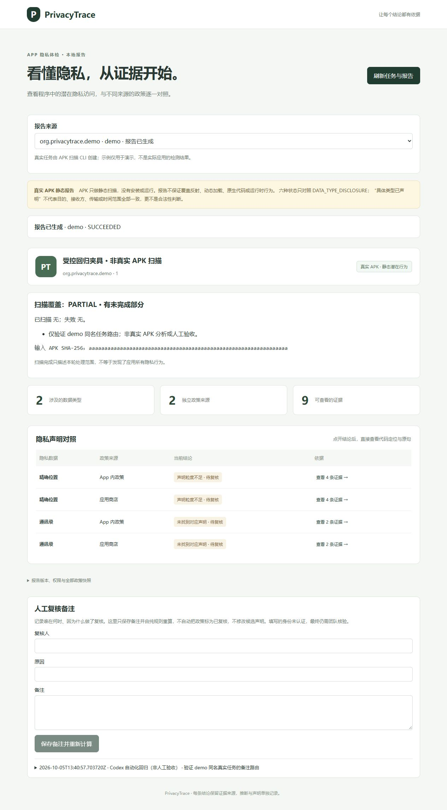

# PrivacyTrace S1 边界修复交付与核验报告

- **日期**：2026-10-05（香港时间）。
- **基线与分支**：`codex/s1-hardening`，基于 `16223ce09b9a68f50b5a07182c3f59274010c09e`（S1 PR #27）。
- **PR 关系**：本轮修复以 S1 分支 `codex/s1-e2e` 为目标，关联 Refs #3, #10, #13, #14, #17；不关闭任务或自动合并。S0 PR #26 已合并至 main。
- **状态判定**：四项修复已实现并完成本地回归；S1 继续保持 `PENDING_HUMAN_AB`。本报告的自动化记录不构成人工复核。

## 1. 任务交付与边界对照

| 任务编号 | 任务定义 | 已实现技术点 | 尚未支持与待办事项 |
| :--- | :--- | :--- | :--- |
| **#10 PT-101** | 完整读取适用的权限声明 | 同时读取 `uses-permission`、`uses-permission-sdk-23`；证据 locator/excerpt 保留 `min_sdk=23` 和可选 `max_sdk`，权限清单去重 | 仅为静态声明能力，不证明用户授权或实际访问；未知设备版本不推断适用结果 |
| **#10 PT-102** | 正确读取整数版本号 | 支持 AXML TYPE_INT_DEC / TYPE_INT_HEX 与十进制字符串，拒绝负数和无效文本 | 不扩展为 split APK 合并或完整 Android 安装兼容性验证 |
| **#13 PT-004** | 防止同名任务并发覆盖 | `create_job()` 在同一跨进程事务内检查与首次写入；流水线在 intake 前取得 ID | 仍为本机 JSON 存储；不新增数据库、用户认证或分布式调度 |
| **#14 PT-807 / #17 PT-808** | 区分真实任务与人工示例 | UI 使用 `job:<id>` 来源值；请求仍使用原始 Job ID；新增六项编译后组件行为测试并接入 CI / 本地检查脚本 | S2 的完整错误、超时、异常降级浏览器矩阵仍待实施 |

分类、匹配规则和数据契约没有改变，不提高任何隐私判定强度，也不改写旧的已发布报告。已有普通无界权限 locator 保持原有格式；SDK 有界声明增加可复核的定位条件。

## 2. 回归证据

- **解析器**：自建二进制 AXML/DEX，覆盖普通 / SDK-23 标签 × 有 / 无 SDK 上限、十进制 / 十六进制整数、最大正有符号 32 位整数、前导零十进制及非法值。测试未安装或执行 APK。
- **作业登记**：四个独立进程竞争同一个 ID，只有一个获得记录；重开 JobStore 后仍为该样本。重复 QUEUED、STATIC_ANALYSIS、CANCELLED、FAILED 作业均在 intake 前拒绝；损坏的已存在记录也不被替换。
- **流水线竞态**：受控调度强制触发旧版“先检查后写入”的间隙，旧版两个输入都进入扫描；修复后只有一个输入进入扫描，另一方得到重复 ID 错误。扫描结果为测试替身，不宣称扫描了真实样本。
- **前端**：编译实际 App.vue，使用 Vue 响应式与受控 API 响应验证空列表、普通 ID、`demo`、`job-demo`、手动切换、备注与取消。
- **修复前后对照**：将同一批新测试运行于基线生产代码，解析定向集为 5 failed / 3 passed，前端为 5 failed / 1 passed，流水线竞态为 1 failed；恢复修复后通过。这些失败数是回归用例数，不是新增缺陷数。

## 3. 本地测试与浏览器记录

| 检查 | 本轮结果 |
| :--- | :--- |
| 后端完整 pytest | 215 passed / 7 skipped；1 条既有 Starlette/HTTPX 弃用警告 |
| Ruff | PASS |
| JSON Schema / TypeScript 契约导出 | PASS；生成文件无差异 |
| 前端组件回归 | 6 passed |
| vue-tsc / Vite build | PASS |
| 浏览器同名任务 | 自动选择真实 `demo` 记录、保存备注、切到人工示例、刷新回到真实任务均通过 |
| 浏览器控制台 error | 本轮检查为空 |
| 本机 Docker | 引擎未运行，7 项 opt-in 容器测试未执行；远程 CI 另按具体提交记录 |

环境为 Windows、Python 3.11.9、既有锁文件依赖。通过 `PYTHONPATH=apps/api/src` 显式加载本次 checkout，复用本机已有依赖环境；没有升级锁文件。本次未获取或重跑 GKD，不沿用组员的 204 项本机 Docker 通过记录作为本轮结果。

可复现命令（先按 README 安装锁定依赖）：

```bash
uv run --project apps/api --locked --extra worker pytest apps/api/tests
uv run --project apps/api --locked --extra worker ruff check apps/api/src apps/api/tests scripts/export-schema.py
uv run --project apps/api --locked --extra worker python scripts/export-schema.py
git diff --exit-code -- packages/contracts apps/web/src/contracts.generated.ts
npm run test --workspace @privacytrace/web
npm run build
```

浏览器数据名称为“受控回归夹具 · 非真实 APK 扫描”，设置 PARTIAL 并标明非真实分析，专门检验真实任务接口与示例的路由差异。备注作者为“Codex 自动化回归（非人工验收）”，不能计入 Issue #15 的 A/B comment。

## 4. 数据保留与下一步

- 本地测试数据位于被忽略的 `data/`、`tmp/`；只提交源码、测试、计划、日志与受控界面截图。
- 终端直连 GitHub 失败，使用已有 GitHub 连接读取固定提交；本地全部文件、文件树和浅克隆提交均按 Git 对象哈希核对。远程变更应保留 S1 实际父提交，不伪造历史。
- 最新计划见 [修复与交接计划](s1-hardening-plan.md)；开发日志见 [2026-10-05](../dev-log/2026-10-05.md)；机器可读结果见 [核验记录](s1-hardening-verification.json)。
- 组员复审修复及当前提交 CI 后，A、B 在 Issue #15 完成逐条人工复核；阶段门槛满足后，再推进 S2 受控 APK 场景和基准评测。

界面证据（受控数据）：


