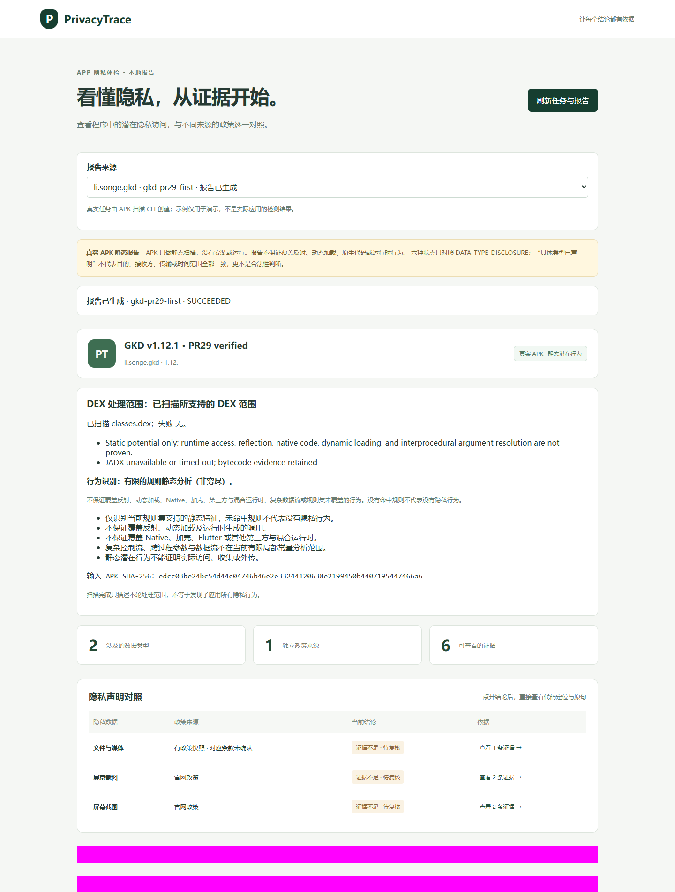

> 历史验证/流程记录：其中 A/B 与 PENDING_HUMAN_AB 门槛已于 2026-10-09 撤销。当前接受状态见 [S1 接受决定](s1-acceptance-20261009.md)，不倒改当时结果或固定 SHA。

# S1 · PR29 真实样本复核准备（2026-10-09）

状态：**技术链路已验证 / PENDING_HUMAN_AB**。本记录是 10/09 的补充核验，不倒填成 10/08 已完成验收，也不代表主线已合并。对应 PT-101 #10、PT-301 #11、PT-503 #12、PT-004 #13、PT-807 #14、PT-901 #15。

## 绑定版本与输入

- 当前整合：[Draft PR #29](https://github.com/MrEcho114/PrivacyTrace/pull/29)，`codex/s1-integrated` → `main`。取舍见 [整合报告](s1-integration-report-20261009.md)。
- 本轮扫描、HTTP 与页面的实现提交：`bb342843b50dc45aec3df111a51537998c81a632`。本记录及模板更新只是后续文档提交；其交付 HEAD/CI 在 PR comment 绑定，不把它冒充扫描时的提交。
- GKD 1.12.1，`li.songe.gkd`，versionCode 92；原始 APK 3,287,479 字节，SHA256 `edcc03be24bc54d44c04746b46e2e33244120638e2199450b4407195447466a6`。沿用已归档样本，不重新下载；扫描前后均核对哈希，原文件未删除。
- 沿用 2026-10-03T12:47:10.664110Z 的离线官网政策快照，版本 `1.0`，原始/处理后文本 SHA256 均为 `bf5917c5c4e9fa2e0700f25db7c17fc0672de0c48de04f6e84e01053871374ea`。本轮未联网更新政策，不声称这是当前线上最新条款。
- worker 从该实现构建，实际 image ID：`sha256:a6b92107f2cfbb4086e894998bdeeac1fe5435601dbeb65cfe792ac58ab44666`；Androguard 4.1.3、规则 0.3.0。生产扫描没有 JADX 源码，保留字节码定位作为依据。

## 两次真实 CLI 与复现

两个独立隔离运行 `gkd-pr29-first` / `gkd-pr29-repro` 均 exit 0 / SUCCEEDED，生成 6 条 evidence、3 条 behavior、2 条 claim、3 条 issue，均为 **INSUFFICIENT_EVIDENCE**。只扫描 `classes.dex`；DEX 完成不等于全面行为检测。APK 未安装或动态运行。

比较的是完整报告的稳定字段：样本、证据、行为、全部政策文本/声明、覆盖说明、规则结果、工具版本和空审阅列表。只排除 `job.id`、`job.created_at`、`result.job_id`、`tools.isolation_receipt` 这四个运行身份/时间/指针字段。JSON 使用 sort_keys、UTF-8、紧凑分隔符序列化，**两次语义完全相同**，归一化 SHA256：

`19e550c636ddbf805fb1c3f67c7567e1858e8398f384b25d5f0ecda8ef3c2157`

这是同一环境、同一路径的复现校验；其余 tools 中仍保留相同的本地政策/审计路径，不声称跨机器或搬迁路径后的哈希也相同。比较在页面写入自动化备注前完成，备注后的报告不混入重跑比对。旧记录使用的归一化范围和 MANIFEST ID 不同，不直接比较旧哈希。

两份真实 Docker inspect 收据分别验证：非 root `65534:65534`、network none、只读根文件系统、唯一只读 APK 输入挂载、cap-drop ALL、no-new-privileges、非 privileged、1 CPU、1 GiB 内存/交换上限、PID 32。两次默认 DELETE_ON_EXIT，输入副本和 reservation 均已移除，cleanup_verified=true，primary_error=null，cleanup_errors=[]。本轮私有目录已设受保护 ACL，仅当前用户、SYSTEM、Administrators；原始样本/全局配置不动。这些检查不是虚拟机级或内核逃逸安全证明。

政策 raw/processed 与初始审计文件均实际校验哈希；60 个分句连续、无损覆盖全文。两条引用原句截取与 excerpt 完全相同。初始审计哈希 `5310a74bba87ec0d7d036f5254e9abea4d0123ce0423eeecb20bc8e6b8537961`。这是结构/留痕检查，不是语义人工确认：快照 COMPLETE，提取 PARTIAL，复核 UNREVIEWED，附件 NOT_CHECKED，地区 UNKNOWN；广泛否定等未映射声明仍需全文复核。

## 本轮待人工核对的定位

| 证据 ID | 静态位置/能力 | 候选声明与原文码点区间 |
|---|---|---|
| `ev-35791bcc4493420937306ecc` | `WRITE_EXTERNAL_STORAGE`；`tag=uses-permission;max_sdk=28`，只说明清单能力 | `policy-claim-2` / `policy-sentence-2`，`[1026,1070)`；带旧设备/旧系统、普通版导出等条件，动作仍 UNKNOWN |
| `ev-887b01d4ad83f18a57ed7051` | classes.dex；`Lr2;->p`，offset_bytes=2；目标 `AccessibilityService.takeScreenshot` | `policy-claim-1` / `policy-sentence-1`，`[363,423)`；条件“仅调试” |
| `ev-be25cc3efeb61d77e109749f` | classes.dex；`Lyw;->A`，offset_bytes=3936；目标 `UiAutomation.takeScreenshot` | 同上，仅为候选条款，不是已确认匹配 |

完整 caller/target 描述符、字节码、政策上下文在本地私有报告内。API 两条 ID 不变；历史 MANIFEST `ev-006e94193f1e009330904b74` 已因 tag/SDK 上界进入 locator 而变化，不把历史 comment 自动套给新证据。

## 实际 HTTP、浏览器与重启

- 使用持久化真实 CLI 报告启动回环 HTTP API，实际 Chromium 加载 Vue 页面；三条结果逐项下钻，核对完整 locator、目标描述符、字节码 excerpt、候选原句高亮/区间与条件。
- 从已加载的报告点结果，再展开候选全文，共 **2 次点击**；全文等于保存快照，并显示 PARTIAL / UNREVIEWED / NOT_CHECKED 与适用范围。候选不被写成匹配依据。
- 在真实作业保存一条 `automation-pr29-NOT-HUMAN` 备注，通过 POST reviews 返回 200；规则结果、政策/claim 均未变，review 事件数为 1，未将政策标成已复核。切换 synthetic 后无真实复核表单，切回并刷新仍看到备注。
- 停止并重启真实 API 进程后，GET report 返回整份 JSON 与此前保存值完全一致；浏览器再次显示三条结果和该备注。
- 首轮页面 **0 page errors**；console 一条 404 的 location 明确是 `http://127.0.0.1:5173/favicon.ico`，没有捕获失败 API response。不写成 console 零错误。
- 公开截图遮盖政策/工具路径/备注区域，仅展示真实作业、覆盖边界与三条结果；已实际查看最终 PNG。详细下钻截图及日志/收据只在受 ACL 保护、Git 忽略的本地目录。截图/日志哈希见 [JSON 摘要](s1-pr29-real-verification-20261009.json)。

## 条款核对与仍缺的验收

| 工单 | 当前证据 | 仍需注意 |
|---|---|---|
| #10 PT-101 | 真实元数据/15 权限；两次实际隔离/输入清理；边界回归见整合测试 | 已知工具人工权限逐项核对仍需成员确认；旧 AAPT2 工具摘要是同样本历史材料，不称本轮新执行 |
| #11 PT-301 | 两处真实 invoke 与精确定位、两次复现；Multidex/字符串等回归见整合测试 | 本轮字节码回退；真实代码人工抽查仍待 A/B，旧 JADX 参考不等于本轮生产反编译 |
| #12 PT-503 | raw/processed/audit 哈希、60 无损分句、两条原句区间与带条件 claim | 否定/主体/条件、全文与适用性仍需 A/B；不把 PARTIAL 改为 COMPLETE |
| #13 PT-004 | CLI 写入规范 JSON；真实 HTTP + 重启读取整份报告/备注相等 | 本地自动化事件身份未认证，不是人工验收；不实现非终态重启调度 |
| #14 PT-807 | 三项两点击定位、全文边界、demo 分离、备注重算与留存；类型/构建见整合测试 | 截图与测试不替代人工语义核验 |
| #15 PT-901 | 三条客观线索、输入/日志/截图哈希、同环境稳定语义复现 | **缺两位不同成员的版本绑定逐条复核 comment** |

公开入口：[Issue #15](https://github.com/MrEcho114/PrivacyTrace/issues/15)，按 [当前 comment 模板](../../evidence/review.comment.template.md) 各用自己的账号发布。2026-10-09 检查该 Issue，仅有自动化交付进度，未收到有效 A/B 评论。机器人备注、PR 进度 comment、CI、单句“同意”均不算。未满足前继续 Draft / PENDING_HUMAN_AB，不关闭工单、不批准/合并 PR、不宣告 S1 完成。

本轮不是重复整合代码测试；扫描实现的本地 306 passed / 0 skipped、前端 11 passed 和对应 CI 见整合报告及 [run 37875231361](https://github.com/MrEcho114/PrivacyTrace/actions/runs/37875231361)。后续文档交付的实际 HEAD/CI 另在 PR comment 记录，旧 receipt 保留原日期/提交。
